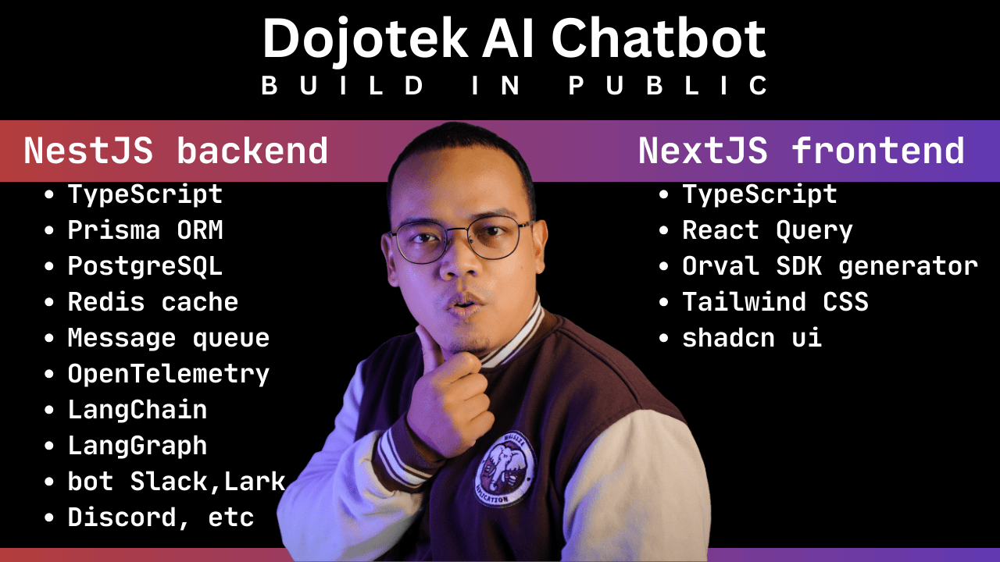

# Andy Primawan, AI full-stack engineer

Andy Primawan is an AI LLM builder (Chatbot RAG, Agentic AI) with expertise in LangChain, LangGraph, LangSmith.

He is also a full-stack engineer with expertise in Node.js, Nest.js, Next.js, React.js, TypeScript, MySQL, PostgreSQL, Redis.

BONUS: experienced to handle AWS, GCP, K3S, Helm Chart.

Delivers robust backends, modern frontends, and cloud-native AI integrations that drive business growth.

You can check the following public GitHub repositories:

- [Dojotek AI Chatbot - backend](https://github.com/dojotek/dojotek-ai-chatbot-backend)
- [Dojotek AI Chatbot - frontend](https://github.com/dojotek/dojotek-ai-chatbot-frontend)
